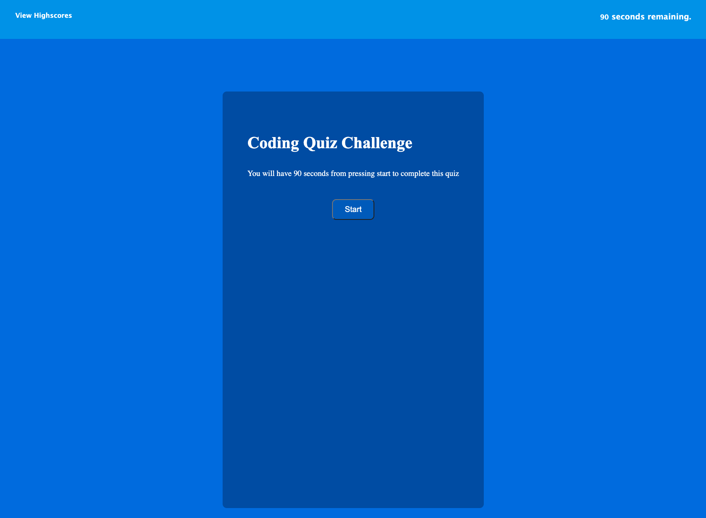

# Javascript Math Quiz

## Description
Simple quiz of 5 questions to test the users knowledge on Maths. User is given 90 seconds and time is deducted if a question is answered incorectly. When the quiz is complete or the timer reaches 0 then the user can input their initials and submit their score to a scoreboard.

## Usage
This application is deployed to a URL and can be accessed using an internet browser. Clicking start will begin the quiz and the quiz will generate questions.

## Credits

## License
Please refer to the LICENSE in the repo

